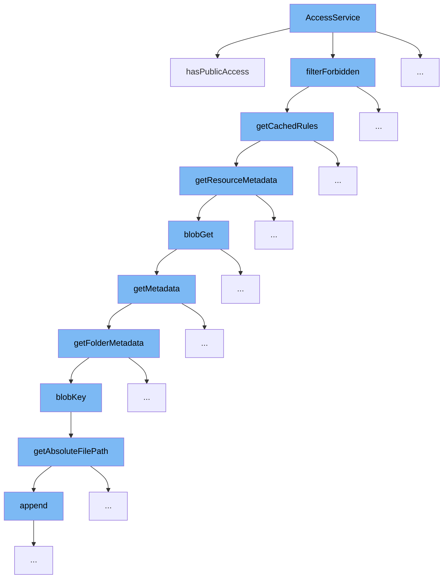

This document will explore the functionality and flow of the `AccessService` in the ai-dial-core repository, specifically focusing on how it manages access control for resources. The flow involves several steps, each contributing to the final decision of whether a resource is accessible to a user or not. We'll cover:

1. Initial access check with `hasPublicAccess`
2. Filtering forbidden resources using `filterForbidden`
3. Retrieving cached rules with `getCachedRules`
4. Fetching resource metadata through `getResourceMetadata`
5. Obtaining blob data with `blobGet`
6. Gathering metadata with `getMetadata`
7. Handling folder metadata via `getFolderMetadata`
8. Generating blob keys in `blobKey`
9. Determining absolute file paths with `getAbsoluteFilePath`



<SwmSnippet path="/src/main/java/com/epam/aidial/core/service/PublicationService.java" line="86">

---

# Initial Access Check

The `hasPublicAccess` function starts the access control flow by checking if the resource is publicly accessible. If not, it proceeds to evaluate more complex access rules.

```java
    public boolean hasPublicAccess(ProxyContext context, ResourceDescription resource) {
        if (!resource.isPublic()) {
            return false;
        }

        Map<String, List<Rule>> rules = getCachedRules();
        Map<String, Boolean> cache = new HashMap<>();

        return evaluate(context, resource, rules, cache);
    }
```

---

</SwmSnippet>

# Filtering Forbidden Resources

The `filterForbidden` function is called next to filter out any resources that are explicitly forbidden based on predefined rules or conditions.

<SwmSnippet path="/src/main/java/com/epam/aidial/core/service/PublicationService.java" line="603">

---

# Retrieving Cached Rules

The `getCachedRules` function retrieves the access rules cached in the system, which are used to determine the accessibility of the resource.

```java
    private Map<String, List<Rule>> getCachedRules() {
        ResourceItemMetadata meta = resources.getResourceMetadata(PUBLIC_RULES);
        long key = (meta == null) ? Long.MIN_VALUE : meta.getUpdatedAt();
        Pair<Long, Map<String, List<Rule>>> current = cachedRules.get();

        if (current == null || current.getKey() != key) {
            Pair<ResourceItemMetadata, String> resource = resources.getResourceWithMetadata(PUBLIC_RULES);
            Pair<Long, Map<String, List<Rule>>> next = (resource == null)
                    ? Pair.of(Long.MIN_VALUE, decodeRules(null))
                    : Pair.of(resource.getKey().getUpdatedAt(), decodeRules(resource.getValue()));

            cachedRules.compareAndSet(current, next);
            current = next;
        }

        return current.getValue();
    }
```

---

</SwmSnippet>

<SwmSnippet path="/src/main/java/com/epam/aidial/core/service/ResourceService.java" line="160">

---

# Fetching Resource Metadata

The `getResourceMetadata` function fetches metadata for the resource, which includes important timestamps and identifiers needed for further processing.

```java
    public ResourceItemMetadata getResourceMetadata(ResourceDescription descriptor) {
        if (descriptor.isFolder()) {
            throw new IllegalArgumentException("Resource folder: " + descriptor.getUrl());
        }

        String redisKey = redisKey(descriptor);
        String blobKey = blobKey(descriptor);
        Result result = redisGet(redisKey, false);

        if (result == null) {
            result = blobGet(blobKey, false);
        }

        if (!result.exists) {
            return null;
        }

        return new ResourceItemMetadata(descriptor)
                .setCreatedAt(result.createdAt)
                .setUpdatedAt(result.updatedAt);
    }
```

---

</SwmSnippet>

<SwmSnippet path="/src/main/java/com/epam/aidial/core/service/ResourceService.java" line="369">

---

# Obtaining Blob Data

The `blobGet` function retrieves the blob data associated with the resource, which is crucial for accessing the actual content of the resource.

```java
    @SneakyThrows
    private Result blobGet(String key, boolean withBody) {
        Blob blob = null;
        BlobMetadata meta;

        if (withBody) {
            blob = blobStore.load(key);
            meta = (blob == null) ? null : blob.getMetadata();
        } else {
            meta = blobStore.meta(key);
        }

        if (meta == null) {
            return BLOB_NOT_FOUND;
        }

        long createdAt = Long.parseLong(meta.getUserMetadata().get("created_at"));
        long updatedAt = Long.parseLong(meta.getUserMetadata().get("updated_at"));

        String body = "";

```

---

</SwmSnippet>

<SwmSnippet path="/src/main/java/com/epam/aidial/core/service/ResourceService.java" line="113">

---

# Gathering Metadata

The `getMetadata` function is used to gather additional metadata for the resource, which may include recursive searches if the resource is a folder.

```java

    @Nullable
    public MetadataBase getMetadata(ResourceDescription descriptor, String token, int limit, boolean recursive) {
        return descriptor.isFolder()
                ? getFolderMetadata(descriptor, token, limit, recursive)
                : getResourceMetadata(descriptor);
    }
```

---

</SwmSnippet>

<SwmSnippet path="/src/main/java/com/epam/aidial/core/service/ResourceService.java" line="121">

---

# Handling Folder Metadata

The `getFolderMetadata` function handles metadata specifically for folder-type resources, aggregating metadata for all items within the folder.

```java
    private ResourceFolderMetadata getFolderMetadata(ResourceDescription descriptor, String token, int limit, boolean recursive) {
        String blobKey = blobKey(descriptor);
        PageSet<? extends StorageMetadata> set = blobStore.list(blobKey, token, limit, recursive);

        if (set.isEmpty() && !descriptor.isRootFolder()) {
            return null;
        }

        List<MetadataBase> resources = set.stream().map(meta -> {
            Map<String, String> metadata = meta.getUserMetadata();
            String path = meta.getName();
            ResourceDescription description = ResourceDescription.fromDecoded(descriptor, path);

            if (meta.getType() != StorageType.BLOB) {
                return new ResourceFolderMetadata(description);
            }

            Long createdAt = null;
            Long updatedAt = null;

            if (metadata != null) {
```

---

</SwmSnippet>

<SwmSnippet path="/src/main/java/com/epam/aidial/core/service/ResourceService.java" line="424">

---

# Generating Blob Keys

The `blobKey` function generates a unique key for the blob associated with the resource, which is used in various retrieval and storage operations.

```java
    private static String blobKey(ResourceDescription descriptor) {
        return descriptor.getAbsoluteFilePath();
    }
```

---

</SwmSnippet>

<SwmSnippet path="/src/main/java/com/epam/aidial/core/storage/ResourceDescription.java" line="59">

---

# Determining Absolute File Paths

The `getAbsoluteFilePath` function constructs the absolute file path for the resource, which is essential for locating the resource within the storage system.

```java
    public String getAbsoluteFilePath() {
        StringBuilder builder = new StringBuilder();
        builder.append(bucketLocation)
                .append(type.getGroup())
                .append(BlobStorageUtil.PATH_SEPARATOR);

        if (!parentFolders.isEmpty()) {
            builder.append(getParentPath())
                    .append(BlobStorageUtil.PATH_SEPARATOR);
        }

        if (name != null) {
            builder.append(name);

            if (isFolder) {
                builder.append(BlobStorageUtil.PATH_SEPARATOR);
            }
        }

        return builder.toString();
    }
```

---

</SwmSnippet>

&nbsp;

*This is an auto-generated document by Swimm AI 🌊 and has not yet been verified by a human*

<SwmMeta version="3.0.0" repo-id="Z2l0aHViJTNBJTNBYWktZGlhbC1jb3JlJTNBJTNBc3dpbW1pbw==" repo-name="ai-dial-core"><sup>Powered by [Swimm](/)</sup></SwmMeta>
