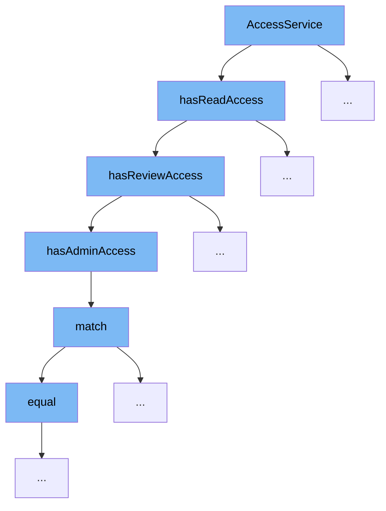

This document will explain the code flow starting with the `AccessService` function, detailing the sequence of function calls and their purpose in the context of resource access control:



<SwmSnippet path="/src/main/java/com/epam/aidial/core/security/AccessService.java" line="34">

---

# Initial Access Check

The `hasReadAccess` function initiates the access control flow by checking various conditions to determine if read access should be granted. This includes checks for auto-shared resources, public access, ownership, application-specific resources, review access, and shared resources.

```java
    public boolean hasReadAccess(ResourceDescription resource, ProxyContext context) {
        if (isAutoShared(resource, context)) {
            return true;
        }

        if (resource.isPublic()) {
            return hasPublicAccess(resource, context, true);
        }

        return isMyResource(resource, context) || isAppResource(resource, context)
                || hasReviewAccess(resource, context, true) || isSharedResource(resource, context);
    }
```

---

</SwmSnippet>

<SwmSnippet path="/src/main/java/com/epam/aidial/core/security/AccessService.java" line="100">

---

# Review Access Check

If the initial checks in `hasReadAccess` do not grant access, the `hasReviewAccess` function is called. This function checks if the resource is under review and if the user has admin access or specific review permissions.

```java
    private boolean hasReviewAccess(ResourceDescription resource, ProxyContext context, boolean readOnly) {
        if (!publicationService.isReviewResource(resource)) {
            return false;
        }

        if (hasAdminAccess(context)) {
            return true;
        }

        return readOnly && publicationService.hasReviewAccess(context, resource);
    }
```

---

</SwmSnippet>

<SwmSnippet path="/src/main/java/com/epam/aidial/core/security/AccessService.java" line="125">

---

# Admin Access Verification

Within the `hasReviewAccess` function, `hasAdminAccess` is called to determine if the user has administrative privileges based on predefined admin rules.

```java
    public boolean hasAdminAccess(ProxyContext context) {
        return RuleMatcher.match(context, adminRules);
    }
```

---

</SwmSnippet>

<SwmSnippet path="/src/main/java/com/epam/aidial/core/security/IdentityProvider.java" line="218">

---

# Rule Matching

The `match` function in the `IdentityProvider` class is used to verify if the JWT token's issuer matches the expected pattern, as part of admin access verification.

```java
    boolean match(DecodedJWT jwt) {
        if (issuerPattern == null) {
            return false;
        }
        String issuer = jwt.getIssuer();
        return issuerPattern.matcher(issuer).matches();
    }
```

---

</SwmSnippet>

<SwmSnippet path="/src/main/java/com/epam/aidial/core/security/RuleMatcher.java" line="47">

---

# Role Equality Check

The `equal` function in the `RuleMatcher` class checks if the user's roles contain any of the target roles required for access, concluding the admin rule verification process.

```java
    private boolean equal(List<String> roles, List<String> targets) {
        for (String target : targets) {
            if (roles.contains(target)) {
                return true;
            }
        }

        return false;
    }
```

---

</SwmSnippet>

&nbsp;

*This is an auto-generated document by Swimm AI 🌊 and has not yet been verified by a human*

<SwmMeta version="3.0.0" repo-id="Z2l0aHViJTNBJTNBYWktZGlhbC1jb3JlJTNBJTNBZXBhbQ==" repo-name="ai-dial-core"><sup>Powered by [Swimm](/)</sup></SwmMeta>
