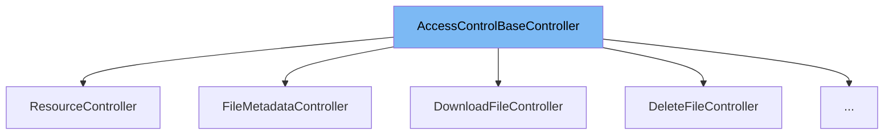

This document will cover the AccessControlBaseController class in the ai-dial-core project. We'll explore:

1. What is AccessControlBaseController?
2. Details of its variables and functions.
3. How it is used in the ResourceController.



# What is AccessControlBaseController

AccessControlBaseController is an abstract class designed to handle access control for resources in the ai-dial-core project. It provides a framework for managing read and write access to resources based on URLs and uses asynchronous operations to handle requests.

<SwmSnippet path="/src/main/java/com/epam/aidial/core/controller/AccessControlBaseController.java" line="14">

---

# Variables and functions

The class contains three main variables: `proxy` of type Proxy, `context` of type ProxyContext, and `isWriteAccess` a boolean indicating if write access is required.

```java
    final Proxy proxy;
    final ProxyContext context;
    final boolean isWriteAccess;
```

---

</SwmSnippet>

<SwmSnippet path="/src/main/java/com/epam/aidial/core/controller/AccessControlBaseController.java" line="18">

---

The `handle` function takes a resource URL, checks access permissions, and if permitted, processes the resource. It's an essential method for resource access control.

```java
    public Future<?> handle(String resourceUrl) {
        ResourceDescription resource;

        try {
            resource = ResourceDescription.fromAnyUrl(resourceUrl, proxy.getEncryptionService());
        } catch (IllegalArgumentException e) {
            String errorMessage = e.getMessage() != null ? e.getMessage() : ("Invalid resource url provided: " + resourceUrl);
            context.respond(HttpStatus.BAD_REQUEST, errorMessage);
            return Future.succeededFuture();
        }

        return proxy.getVertx()
                .executeBlocking(() -> {
                    AccessService service = proxy.getAccessService();
                    return isWriteAccess ? service.hasWriteAccess(resource, context) : service.hasReadAccess(resource, context);
                })
                .map(hasAccess -> {
                    if (hasAccess) {
                        handle(resource);
                    } else {
                        context.respond(HttpStatus.FORBIDDEN, "You don't have an access to: " + resourceUrl);
```

---

</SwmSnippet>

<SwmSnippet path="/src/main/java/com/epam/aidial/core/controller/ResourceController.java" line="39">

---

# Usage example

ResourceController, which extends AccessControlBaseController, overrides the `handle` method to provide specific implementations for GET, PUT, and DELETE HTTP methods, demonstrating how to use AccessControlBaseController in a concrete class.

```java
    public ResourceController(Proxy proxy, ProxyContext context, boolean metadata) {
        // PUT and DELETE require full access, GET - not
        super(proxy, context, !HttpMethod.GET.equals(context.getRequest().method()));
        this.vertx = proxy.getVertx();
        this.service = proxy.getResourceService();
        this.shareService = proxy.getShareService();
        this.lockService = proxy.getLockService();
        this.invitationService = proxy.getInvitationService();
        this.metadata = metadata;
    }

    @Override
    protected Future<?> handle(ResourceDescription descriptor) {
        if (context.getRequest().method() == HttpMethod.GET) {
            return metadata ? getMetadata(descriptor) : getResource(descriptor);
        }

        if (context.getRequest().method() == HttpMethod.PUT) {
            return putResource(descriptor);
        }

```

---

</SwmSnippet>

&nbsp;

*This is an auto-generated document by Swimm AI 🌊 and has not yet been verified by a human*

<SwmMeta version="3.0.0" repo-id="Z2l0aHViJTNBJTNBYWktZGlhbC1jb3JlJTNBJTNBc3dpbW1pbw==" repo-name="ai-dial-core"><sup>Powered by [Swimm](/)</sup></SwmMeta>
