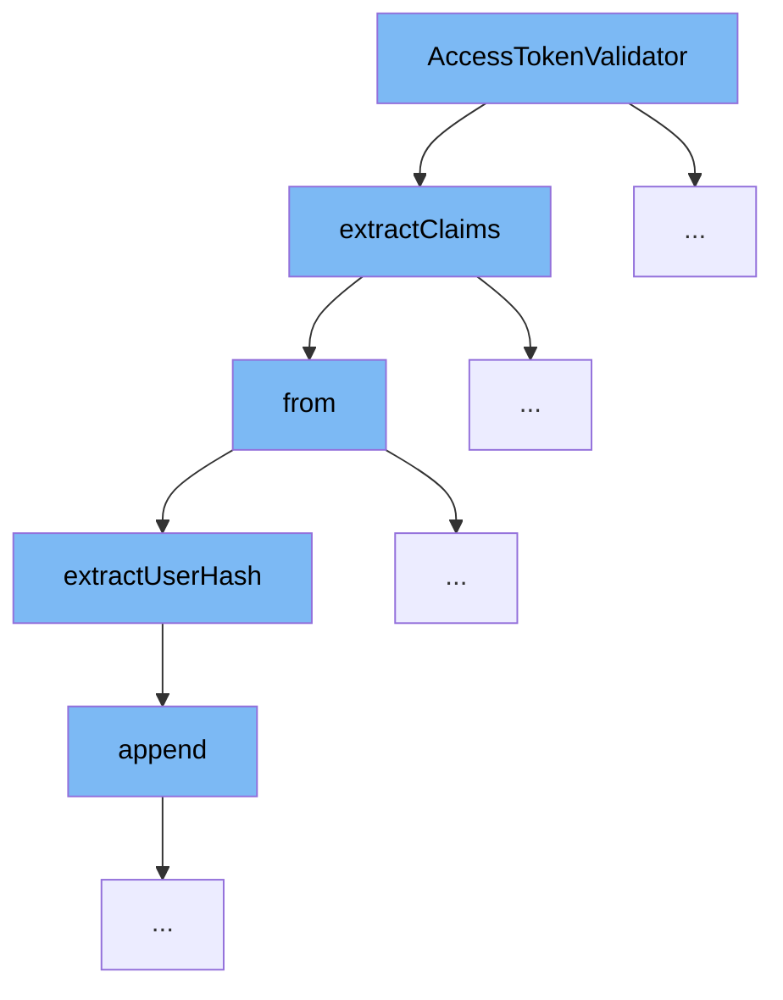

This document outlines the authentication flow initiated by the `AccessTokenValidator` function in the ai-dial-core project. The flow ensures secure access to the system by validating access tokens and extracting necessary user claims. The steps involved are:

1. Validating the access token.
2. Extracting claims from the token.
3. Retrieving user-specific details from the claims.



<SwmSnippet path="/src/main/java/com/epam/aidial/core/security/IdentityProvider.java" line="204">

---

# Validating the Access Token

The `extractClaims` method starts by checking if the provided JWT is null, and if not, it proceeds to verify the JWT. This step is crucial for ensuring that the access token provided is valid and has not been tampered with.

```java
    Future<ExtractedClaims> extractClaims(DecodedJWT decodedJwt) {
        if (decodedJwt == null) {
            return Future.failedFuture(new IllegalArgumentException("decoded JWT must not be null"));
        }
        if (disableJwtVerification) {
            return Future.succeededFuture(from(decodedJwt));
        }
        return verifyJwt(decodedJwt).map(this::from);
    }
```

---

</SwmSnippet>

<SwmSnippet path="/src/main/java/com/epam/aidial/core/security/IdentityProvider.java" line="214">

---

# Extracting Claims

Once the JWT is verified, the `from` method is called to extract specific claims from the JWT. This includes user subject, roles, and a user hash. This step is essential for retrieving the necessary information to identify and authorize the user.

```java
    private ExtractedClaims from(DecodedJWT jwt) {
        return new ExtractedClaims(extractUserSub(jwt), extractUserRoles(jwt), extractUserHash(jwt));
    }
```

---

</SwmSnippet>

<SwmSnippet path="/src/main/java/com/epam/aidial/core/security/IdentityProvider.java" line="187">

---

# Retrieving User-Specific Details

The `extractUserHash` method is used to generate a unique hash for the user based on their email claim. This hash is used internally for logging and tracking user activities without exposing the user's actual email. This step is vital for maintaining user privacy and security.

```java
    private String extractUserHash(DecodedJWT decodedJwt) {
        String keyClaim = decodedJwt.getClaim(loggingKey).asString();
        if (keyClaim != null && obfuscateUserEmail) {
            String keyClaimWithSalt = loggingSalt + keyClaim;
            byte[] hash = sha256Digest.digest(keyClaimWithSalt.getBytes(StandardCharsets.UTF_8));

            StringBuilder hashString = new StringBuilder();
            for (byte b : hash) {
                hashString.append(String.format("%02x", b));
            }

            return hashString.toString();
        }

        return keyClaim;
    }
```

---

</SwmSnippet>

&nbsp;

*This is an auto-generated document by Swimm AI 🌊 and has not yet been verified by a human*

<SwmMeta version="3.0.0" repo-id="Z2l0aHViJTNBJTNBYWktZGlhbC1jb3JlJTNBJTNBZXBhbQ==" repo-name="ai-dial-core"><sup>Powered by [Swimm](/)</sup></SwmMeta>
