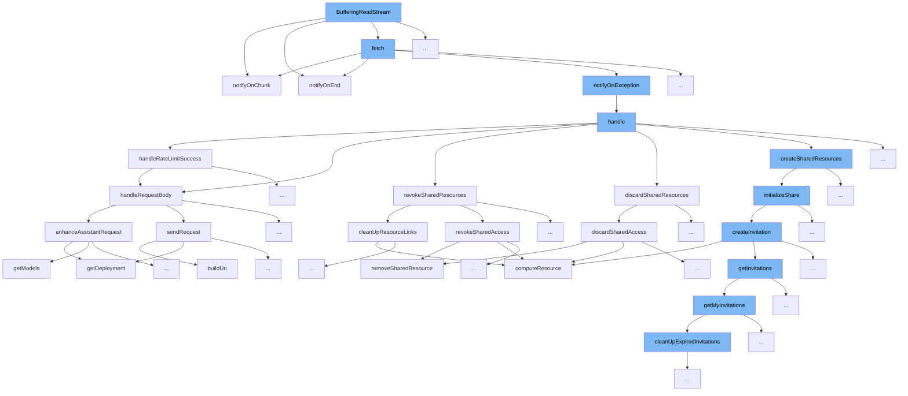

This document will explore the functionality and flow of the `BufferingReadStream` class within the ai-dial-core project, focusing on its role in handling data streams efficiently. The following aspects will be covered:

1. The purpose and functionality of `BufferingReadStream`.
2. The sequence of method calls initiated by `BufferingReadStream` and their roles in data handling.



<SwmSnippet path="/src/main/java/com/epam/aidial/core/util/BufferingReadStream.java" line="128">

---

# BufferingReadStream Overview

The `BufferingReadStream` class is designed to handle data chunks efficiently. It uses a method `notifyOnChunk` to process each data chunk as it is read. This method checks if a chunk handler is set and if so, it attempts to handle the chunk. If any exception occurs during the handling, it logs a warning.

```java
    private synchronized void notifyOnChunk(Buffer chunk) {
        if (chunkHandler != null) {
            try {
                chunkHandler.handle(chunk);
            } catch (Throwable e) {
                log.warn("Chunk handler threw exception buffering read stream: {}", e.getMessage());
            }
        }
    }
```

---

</SwmSnippet>

# Data Handling Flow

The `BufferingReadStream` initiates a sequence of method calls to manage data streams effectively. This includes notifying on data chunks, handling exceptions, and managing resource sharing and cleanup.

<SwmSnippet path="/src/main/java/com/epam/aidial/core/util/BufferingReadStream.java" line="128">

---

# Step 1: Handling Data Chunks

The `notifyOnChunk` method is triggered by `BufferingReadStream` to handle incoming data chunks. It processes each chunk through a designated handler, ensuring that data is managed as it streams in.

```java
    private synchronized void notifyOnChunk(Buffer chunk) {
        if (chunkHandler != null) {
            try {
                chunkHandler.handle(chunk);
            } catch (Throwable e) {
                log.warn("Chunk handler threw exception buffering read stream: {}", e.getMessage());
            }
        }
    }
```

---

</SwmSnippet>

<SwmSnippet path="/src/main/java/com/epam/aidial/core/util/BufferingReadStream.java" line="132">

---

# Step 2: Exception Handling in Data Stream

If an exception occurs during the handling of a data chunk, `notifyOnChunk` logs a warning. This ensures that the system remains informed of any issues without halting the data processing.

```java
            } catch (Throwable e) {
                log.warn("Chunk handler threw exception buffering read stream: {}", e.getMessage());
            }
```

---

</SwmSnippet>

<SwmSnippet path="/src/main/java/com/epam/aidial/core/controller/ResourceController.java" line="50">

---

# Step 3: Resource Management

Following the data handling, the `handle` method in `ResourceController` is called to manage resources based on the request type (GET, PUT, DELETE). This method routes the request to appropriate handlers for resource retrieval, update, or deletion.

```java
    @Override
    protected Future<?> handle(ResourceDescription descriptor) {
        if (context.getRequest().method() == HttpMethod.GET) {
            return metadata ? getMetadata(descriptor) : getResource(descriptor);
        }

        if (context.getRequest().method() == HttpMethod.PUT) {
            return putResource(descriptor);
        }

        if (context.getRequest().method() == HttpMethod.DELETE) {
            return deleteResource(descriptor);
        }

        return context.respond(HttpStatus.BAD_GATEWAY, "No route");
    }
```

---

</SwmSnippet>

&nbsp;

*This is an auto-generated document by Swimm AI 🌊 and has not yet been verified by a human*

<SwmMeta version="3.0.0" repo-id="Z2l0aHViJTNBJTNBYWktZGlhbC1jb3JlJTNBJTNBc3dpbW1pbw==" repo-name="ai-dial-core"><sup>Powered by [Swimm](/)</sup></SwmMeta>
