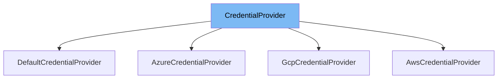

This document will cover the `CredentialProvider` class in the ai-dial-core project. We'll explore:

1. What `CredentialProvider` is and its purpose.
2. The variables and functions defined in `CredentialProvider`.
3. How to use `CredentialProvider` in `DefaultCredentialProvider`.



# What is CredentialProvider

The `CredentialProvider` is an interface in the ai-dial-core project designed to abstract the retrieval of credentials. It is used across various parts of the system where credentials are required, ensuring a consistent approach to credential management.

# Variables and functions

The `CredentialProvider` interface defines a single method `getCredentials` which is essential for obtaining credentials.

<SwmSnippet path="/src/main/java/com/epam/aidial/core/storage/credential/CredentialProvider.java" line="7">

---

# Variables and functions

The `getCredentials` method is declared here. It is designed to be implemented by classes that provide specific mechanisms for retrieving credentials.

```java
    Credentials getCredentials();
```

---

</SwmSnippet>

# Usage example

Below is an example of how `CredentialProvider` is implemented and used in the `DefaultCredentialProvider` class.

<SwmSnippet path="/src/main/java/com/epam/aidial/core/storage/credential/DefaultCredentialProvider.java" line="11">

---

# Usage example

Here, `DefaultCredentialProvider` implements `CredentialProvider`. It initializes credentials in the constructor and returns them in the `getCredentials` method.

```java
    public DefaultCredentialProvider(String identity, String credential) {
        this.credentials = new Credentials(Objects.requireNonNull(identity), Objects.requireNonNull(credential));
    }

    @Override
    public Credentials getCredentials() {
        return credentials;
    }
```

---

</SwmSnippet>

&nbsp;

*This is an auto-generated document by Swimm AI 🌊 and has not yet been verified by a human*

<SwmMeta version="3.0.0" repo-id="Z2l0aHViJTNBJTNBYWktZGlhbC1jb3JlJTNBJTNBZXBhbQ==" repo-name="ai-dial-core"><sup>Powered by [Swimm](/)</sup></SwmMeta>
