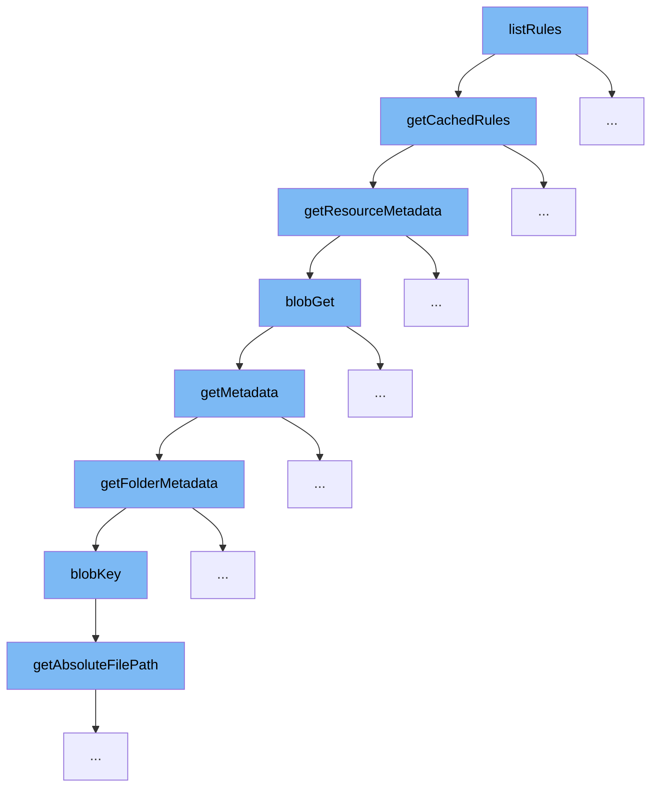

This document will explain the code flow initiated by the `listRules` function in the ai-dial-core project, detailing each function call and its purpose within the flow.



<SwmSnippet path="/src/main/java/com/epam/aidial/core/service/PublicationService.java" line="603">

---

# Overview of `listRules` Function

The `listRules` function initiates the flow by calling `getCachedRules` to retrieve rules from cache or storage. This is the entry point of the flow, setting the context for subsequent operations.

```java
    private Map<String, List<Rule>> getCachedRules() {
        ResourceItemMetadata meta = resources.getResourceMetadata(PUBLIC_RULES);
        long key = (meta == null) ? Long.MIN_VALUE : meta.getUpdatedAt();
        Pair<Long, Map<String, List<Rule>>> current = cachedRules.get();

        if (current == null || current.getKey() != key) {
            Pair<ResourceItemMetadata, String> resource = resources.getResourceWithMetadata(PUBLIC_RULES);
            Pair<Long, Map<String, List<Rule>>> next = (resource == null)
                    ? Pair.of(Long.MIN_VALUE, decodeRules(null))
                    : Pair.of(resource.getKey().getUpdatedAt(), decodeRules(resource.getValue()));

            cachedRules.compareAndSet(current, next);
            current = next;
        }

        return current.getValue();
    }
```

---

</SwmSnippet>

<SwmSnippet path="/src/main/java/com/epam/aidial/core/service/PublicationService.java" line="603">

---

# Step 1: Retrieve Cached Rules

`getCachedRules` checks for updated rules in the cache. If the cache is outdated or empty, it fetches updated rules metadata using `getResourceMetadata`, ensuring that the most current rules are used.

```java
    private Map<String, List<Rule>> getCachedRules() {
        ResourceItemMetadata meta = resources.getResourceMetadata(PUBLIC_RULES);
        long key = (meta == null) ? Long.MIN_VALUE : meta.getUpdatedAt();
        Pair<Long, Map<String, List<Rule>>> current = cachedRules.get();

        if (current == null || current.getKey() != key) {
            Pair<ResourceItemMetadata, String> resource = resources.getResourceWithMetadata(PUBLIC_RULES);
            Pair<Long, Map<String, List<Rule>>> next = (resource == null)
                    ? Pair.of(Long.MIN_VALUE, decodeRules(null))
                    : Pair.of(resource.getKey().getUpdatedAt(), decodeRules(resource.getValue()));

            cachedRules.compareAndSet(current, next);
            current = next;
        }

        return current.getValue();
    }
```

---

</SwmSnippet>

<SwmSnippet path="/src/main/java/com/epam/aidial/core/service/ResourceService.java" line="160">

---

# Step 2: Get Resource Metadata

The `getResourceMetadata` function is called by `getCachedRules` to fetch metadata for the rules resource. This function handles the retrieval of metadata from either Redis or Blob storage, crucial for determining the freshness of cached data.

```java
    public ResourceItemMetadata getResourceMetadata(ResourceDescription descriptor) {
        if (descriptor.isFolder()) {
            throw new IllegalArgumentException("Resource folder: " + descriptor.getUrl());
        }

        String redisKey = redisKey(descriptor);
        String blobKey = blobKey(descriptor);
        Result result = redisGet(redisKey, false);

        if (result == null) {
            result = blobGet(blobKey, false);
        }

        if (!result.exists) {
            return null;
        }

        return new ResourceItemMetadata(descriptor)
                .setCreatedAt(result.createdAt)
                .setUpdatedAt(result.updatedAt);
    }
```

---

</SwmSnippet>

<SwmSnippet path="/src/main/java/com/epam/aidial/core/service/ResourceService.java" line="369">

---

# Step 3: Retrieve Blob Data

`blobGet` is triggered if the metadata is not found in Redis. It fetches the blob from storage, which includes the actual rules data needed if the cache is to be updated.

```java
    @SneakyThrows
    private Result blobGet(String key, boolean withBody) {
        Blob blob = null;
        BlobMetadata meta;

        if (withBody) {
            blob = blobStore.load(key);
            meta = (blob == null) ? null : blob.getMetadata();
        } else {
            meta = blobStore.meta(key);
        }

        if (meta == null) {
            return BLOB_NOT_FOUND;
        }

        long createdAt = Long.parseLong(meta.getUserMetadata().get("created_at"));
        long updatedAt = Long.parseLong(meta.getUserMetadata().get("updated_at"));

        String body = "";

```

---

</SwmSnippet>

<SwmSnippet path="/src/main/java/com/epam/aidial/core/service/ResourceService.java" line="114">

---

# Step 4: Metadata Retrieval

`getMetadata` is a helper function called within the metadata retrieval process, orchestrating the fetching of either folder or resource metadata based on the type of resource descriptor provided.

```java
    @Nullable
    public MetadataBase getMetadata(ResourceDescription descriptor, String token, int limit, boolean recursive) {
        return descriptor.isFolder()
                ? getFolderMetadata(descriptor, token, limit, recursive)
                : getResourceMetadata(descriptor);
    }

```

---

</SwmSnippet>

<SwmSnippet path="/src/main/java/com/epam/aidial/core/service/ResourceService.java" line="121">

---

# Step 5: Folder Metadata Handling

In cases where the resource is a folder, `getFolderMetadata` processes the folder's contents to extract metadata for each item within, which is essential for resources organized in a hierarchical structure.

```java
    private ResourceFolderMetadata getFolderMetadata(ResourceDescription descriptor, String token, int limit, boolean recursive) {
        String blobKey = blobKey(descriptor);
        PageSet<? extends StorageMetadata> set = blobStore.list(blobKey, token, limit, recursive);

        if (set.isEmpty() && !descriptor.isRootFolder()) {
            return null;
        }

        List<MetadataBase> resources = set.stream().map(meta -> {
            Map<String, String> metadata = meta.getUserMetadata();
            String path = meta.getName();
            ResourceDescription description = ResourceDescription.fromDecoded(descriptor, path);

            if (meta.getType() != StorageType.BLOB) {
                return new ResourceFolderMetadata(description);
            }

            Long createdAt = null;
            Long updatedAt = null;

            if (metadata != null) {
```

---

</SwmSnippet>

<SwmSnippet path="/src/main/java/com/epam/aidial/core/service/ResourceService.java" line="424">

---

# Step 6: Generate Blob Key

`blobKey` function generates a key for blob storage operations, derived from the absolute file path of the resource. This key is crucial for locating the correct blob in storage.

```java
    private static String blobKey(ResourceDescription descriptor) {
        return descriptor.getAbsoluteFilePath();
    }
```

---

</SwmSnippet>

&nbsp;

*This is an auto-generated document by Swimm AI 🌊 and has not yet been verified by a human*

<SwmMeta version="3.0.0" repo-id="Z2l0aHViJTNBJTNBYWktZGlhbC1jb3JlJTNBJTNBZXBhbQ==" repo-name="ai-dial-core"><sup>Powered by [Swimm](/)</sup></SwmMeta>
