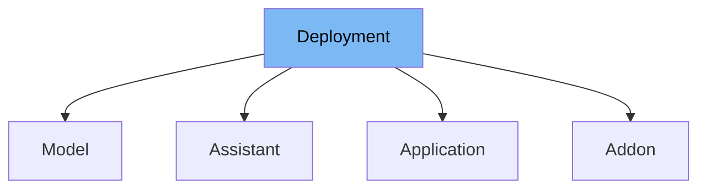

This document will cover the `Deployment` class located in the `ai-dial-core` repository. We'll explore:

1. What the `Deployment` class is and its purpose.
2. The variables and functions defined within the `Deployment` class.
3. How to use the `Deployment` class in a model.



# What is Deployment

The `Deployment` class in `src/main/java/com/epam/aidial/core/config/Deployment.java` is an abstract class designed to represent various deployment configurations within the system. It serves as a base class for specific types of deployments, encapsulating common properties like name, endpoint, and authentication settings. This class is crucial for managing different deployment settings and features in a unified manner.

<SwmSnippet path="/src/main/java/com/epam/aidial/core/config/Deployment.java" line="10">

---

# Variables and functions

The `Deployment` class defines several variables such as `name`, `endpoint`, `displayName`, `displayVersion`, `iconUrl`, `description`, `userRoles`, `forwardAuthToken`, `features`, `inputAttachmentTypes`, and `maxInputAttachments`. These variables store various configurations related to a deployment.

```java
    private String name;
    private String endpoint;
    private String displayName;
    private String displayVersion;
    private String iconUrl;
    private String description;
    private Set<String> userRoles = Set.of();
    /**
     * Forward Http header with authorization token when request is sent to deployment.
     * Authorization token is NOT forwarded by default.
     */
    private boolean forwardAuthToken = false;
    private Features features;
    private List<String> inputAttachmentTypes;
    private Integer maxInputAttachments;
}
```

---

</SwmSnippet>

# Usage example

To utilize the `Deployment` class, you can extend it in other classes like `Model`. For instance, in `Model.java`, `Deployment` is extended to include additional properties specific to models such as `type`, `tokenizerModel`, and `pricing`. Here's a snippet on how `Deployment` is used in a model:

```java
public class Model extends Deployment {
    private ModelType type;
    private String tokenizerModel;
    // Additional properties and methods
}
```

&nbsp;

*This is an auto-generated document by Swimm AI 🌊 and has not yet been verified by a human*

<SwmMeta version="3.0.0" repo-id="Z2l0aHViJTNBJTNBYWktZGlhbC1jb3JlJTNBJTNBc3dpbW1pbw==" repo-name="ai-dial-core"><sup>Powered by [Swimm](/)</sup></SwmMeta>
