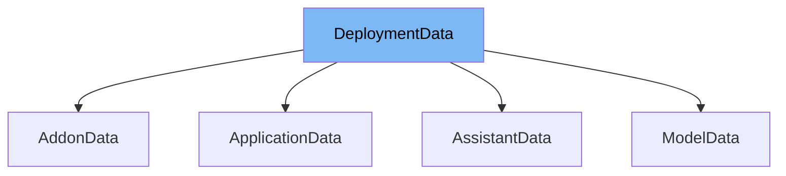

This document provides a comprehensive overview of the `DeploymentData` class used in the ai-dial-core project. We will cover:

1. What `DeploymentData` is and its purpose.
2. Detailed descriptions of its variables and functions.
3. An example of how `DeploymentData` is utilized in `AddonData`.



# What is DeploymentData

The `DeploymentData` class in `src/main/java/com/epam/aidial/core/data/DeploymentData.java` serves as a data model for storing deployment-related information within the system. It is designed to encapsulate details such as model, addon, assistant, and application identifiers, along with metadata like display name, version, and descriptions. This class is crucial for managing deployment states and configurations across different components of the application.

<SwmSnippet path="/src/main/java/com/epam/aidial/core/data/DeploymentData.java" line="14">

---

# Variables and functions

The `DeploymentData` class includes various fields such as `id`, `model`, `addon`, `assistant`, `application`, `displayName`, `displayVersion`, `iconUrl`, `description`, `owner`, `object`, `status`, `createdAt`, `updatedAt`, `scaleSettings`, `features`, `inputAttachmentTypes`, and `maxInputAttachments`. These fields store specific attributes of a deployment, helping in its identification, configuration, and display within the system.

```java
    private String id;
    private String model;
    private String addon;
    private String assistant;
    private String application;
    private String displayName;
    private String displayVersion;
    private String iconUrl;
    private String description;
    private String owner = "organization-owner";
    private String object = "deployment";
    private String status = "succeeded";
    private long createdAt = 1672534800;
    private long updatedAt = 1672534800;
    private ScaleSettingsData scaleSettings = new ScaleSettingsData();
    private FeaturesData features = new FeaturesData();
    private List<String> inputAttachmentTypes;
    private Integer maxInputAttachments;
}
```

---

</SwmSnippet>

<SwmSnippet path="/src/main/java/com/epam/aidial/core/data/AddonData.java" line="13">

---

# Usage example

The `AddonData` class extends `DeploymentData` and is used as an example of how `DeploymentData` can be specialized for specific types of deployments. In this case, `AddonData` modifies the `object` field to 'addon' and sets `scaleSettings` to null, demonstrating customization of the base deployment data for addon-specific configurations.

```java
public class AddonData extends DeploymentData {
    {
        setObject("addon");
        setScaleSettings(null);
    }
```

---

</SwmSnippet>

&nbsp;

*This is an auto-generated document by Swimm AI 🌊 and has not yet been verified by a human*

<SwmMeta version="3.0.0" repo-id="Z2l0aHViJTNBJTNBYWktZGlhbC1jb3JlJTNBJTNBZXBhbQ==" repo-name="ai-dial-core"><sup>Powered by [Swimm](/)</sup></SwmMeta>
