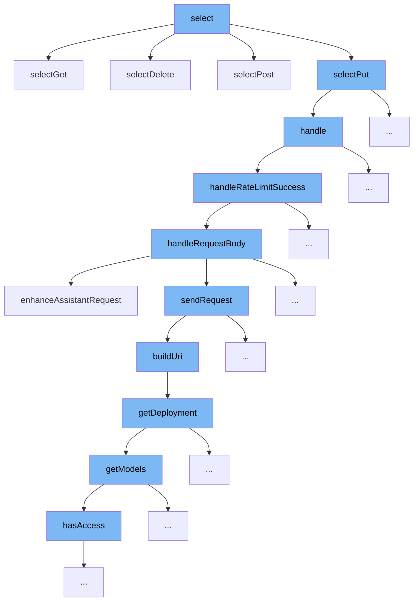

This document will cover the flow of handling HTTP requests based on the `select` function in the ai-dial-core repository. We'll cover:

1. How the `select` function routes different HTTP methods.
2. The process of handling PUT requests.
3. Rate limiting and request body handling for POST requests.
4. Enhancing requests and sending them to the appropriate URI.



<SwmSnippet path="/src/main/java/com/epam/aidial/core/controller/ControllerSelector.java" line="79">

---

# Routing HTTP Methods

The `select` function routes incoming HTTP requests to specific controllers based on the request path. It uses pattern matching to determine the appropriate controller for GET, POST, PUT, DELETE, and other HTTP methods.

```java
    private static Controller selectGet(Proxy proxy, ProxyContext context, String path) {
        Matcher match;

        match = match(PATTERN_DEPLOYMENT, path);
        if (match != null) {
            DeploymentController controller = new DeploymentController(context);
            String deploymentId = UrlUtil.decodePath(match.group(1));
            return () -> controller.getDeployment(deploymentId);
        }

        match = match(PATTERN_DEPLOYMENTS, path);
        if (match != null) {
            DeploymentController controller = new DeploymentController(context);
            return controller::getDeployments;
        }

        match = match(PATTERN_MODEL, path);
        if (match != null) {
            ModelController controller = new ModelController(context);
            String modelId = UrlUtil.decodePath(match.group(1));
            return () -> controller.getModel(modelId);
```

---

</SwmSnippet>

<SwmSnippet path="/src/main/java/com/epam/aidial/core/controller/ResourceController.java" line="50">

---

# Handling PUT Requests

The `handle` function in `ResourceController` processes PUT requests by calling `putResource`, which handles the resource update logic.

```java
    @Override
    protected Future<?> handle(ResourceDescription descriptor) {
        if (context.getRequest().method() == HttpMethod.GET) {
            return metadata ? getMetadata(descriptor) : getResource(descriptor);
        }

        if (context.getRequest().method() == HttpMethod.PUT) {
            return putResource(descriptor);
        }

        if (context.getRequest().method() == HttpMethod.DELETE) {
            return deleteResource(descriptor);
        }

        return context.respond(HttpStatus.BAD_GATEWAY, "No route");
    }
```

---

</SwmSnippet>

<SwmSnippet path="/src/main/java/com/epam/aidial/core/controller/DeploymentPostController.java" line="109">

---

# Rate Limiting and Request Body Handling

The `handleRateLimitSuccess` function manages successful rate limit checks and proceeds to handle the request body for POST requests. It sets up the route and API key data, then processes the request body.

```java
    private void handleRateLimitSuccess(String deploymentId) {
        log.info("Received request from client. Trace: {}. Span: {}. Key: {}. Deployment: {}. Headers: {}",
                context.getTraceId(), context.getSpanId(),
                context.getProject(), context.getDeployment().getName(),
                context.getRequest().headers().size());

        UpstreamProvider endpointProvider = new DeploymentUpstreamProvider(context.getDeployment());
        UpstreamRoute endpointRoute = proxy.getUpstreamBalancer().balance(endpointProvider);
        context.setUpstreamRoute(endpointRoute);

        if (!endpointRoute.hasNext()) {
            log.error("No route. Trace: {}. Span: {}. Key: {}. Deployment: {}. User sub: {}",
                    context.getTraceId(), context.getSpanId(),
                    context.getProject(), deploymentId, context.getUserSub());

            respond(HttpStatus.BAD_GATEWAY, "No route");
            return;
        }

        ApiKeyData proxyApiKeyData = new ApiKeyData();
        context.setProxyApiKeyData(proxyApiKeyData);
```

---

</SwmSnippet>

<SwmSnippet path="/src/main/java/com/epam/aidial/core/controller/DeploymentPostController.java" line="189">

---

# Enhancing Requests and Sending to URI

The `handleRequestBody` function enhances the request by adding necessary headers and data, then calls `sendRequest` to forward the request to the built URI.

```java
    }

    @VisibleForTesting
    void handleRequestBody(Buffer requestBody) {
        Deployment deployment = context.getDeployment();
        log.info("Received body from client. Trace: {}. Span: {}. Key: {}. Deployment: {}. Length: {}",
                context.getTraceId(), context.getSpanId(),
                context.getProject(), deployment.getName(), requestBody.length());

        context.setRequestBody(requestBody);
        context.setRequestBodyTimestamp(System.currentTimeMillis());

        try (InputStream stream = new ByteBufInputStream(requestBody.getByteBuf())) {
            ObjectNode tree = (ObjectNode) ProxyUtil.MAPPER.readTree(stream);

            try {
                ProxyUtil.collectAttachedFiles(tree, this::processAttachedFile);
            } catch (HttpException e) {
                respond(e.getStatus(), e.getMessage());
                log.warn("Can't collect attached files. Trace: {}. Span: {}. Error: {}",
                        context.getTraceId(), context.getSpanId(), e.getMessage());
```

---

</SwmSnippet>

&nbsp;

*This is an auto-generated document by Swimm AI 🌊 and has not yet been verified by a human*

<SwmMeta version="3.0.0" repo-id="Z2l0aHViJTNBJTNBYWktZGlhbC1jb3JlJTNBJTNBZXBhbQ==" repo-name="ai-dial-core"><sup>Powered by [Swimm](/)</sup></SwmMeta>
