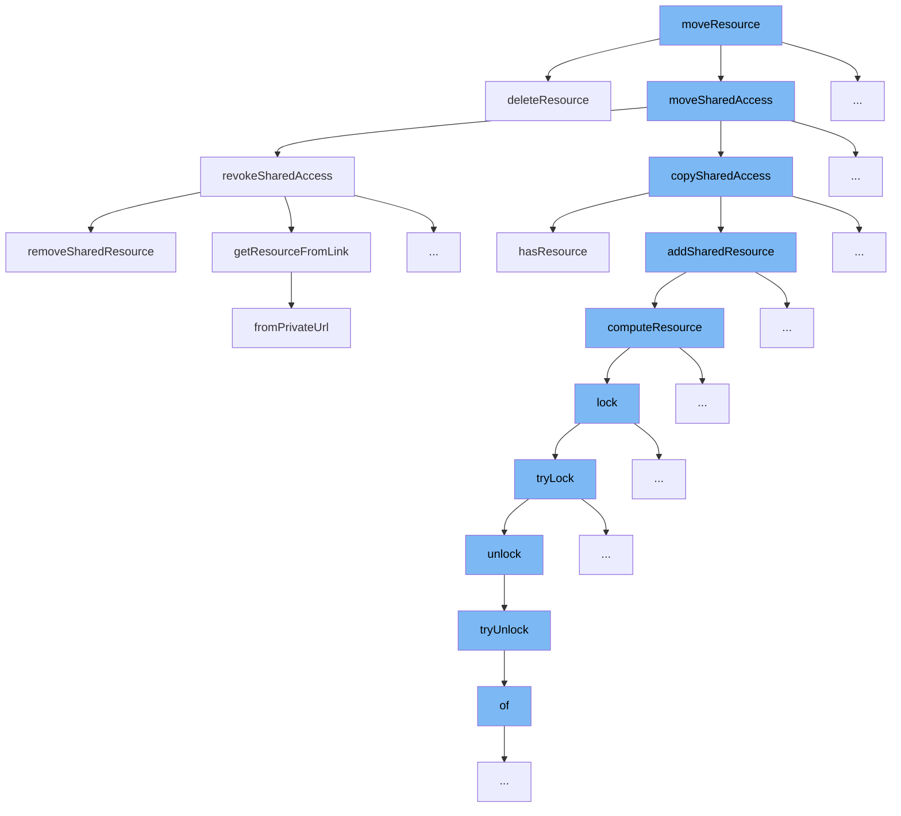

This document will explain the flow initiated by the `moveResource` function in the ai-dial-core repository, detailing each step and its purpose in the context of resource management.



<SwmSnippet path="/src/main/java/com/epam/aidial/core/service/ResourceService.java" line="284">

---

# Overview of `moveResource` Function

The `moveResource` function initiates a process to safely move a resource from one location to another. This involves deleting the original resource and managing shared access rights.

```java
    public boolean deleteResource(ResourceDescription descriptor) {
        String redisKey = redisKey(descriptor);
        String blobKey = blobKey(descriptor);

        try (var ignore = lockService.lock(redisKey)) {
            Result result = redisGet(redisKey, false);
            boolean existed = (result == null) ? blobExists(blobKey) : result.exists;

            if (!existed) {
                return false;
            }

            redisPut(redisKey, new Result("", Long.MIN_VALUE, Long.MIN_VALUE, false, false));
            blobDelete(blobKey);
            redisSync(redisKey);

            return true;
        }
    }
```

---

</SwmSnippet>

<SwmSnippet path="/src/main/java/com/epam/aidial/core/service/ResourceService.java" line="284">

---

# Step 1: Delete Resource

The `deleteResource` function is called by `moveResource` to remove the resource from its original location. This step ensures that the resource no longer exists at the source before it is recreated elsewhere.

```java
    public boolean deleteResource(ResourceDescription descriptor) {
        String redisKey = redisKey(descriptor);
        String blobKey = blobKey(descriptor);

        try (var ignore = lockService.lock(redisKey)) {
            Result result = redisGet(redisKey, false);
            boolean existed = (result == null) ? blobExists(blobKey) : result.exists;

            if (!existed) {
                return false;
            }

            redisPut(redisKey, new Result("", Long.MIN_VALUE, Long.MIN_VALUE, false, false));
            blobDelete(blobKey);
            redisSync(redisKey);

            return true;
        }
    }
```

---

</SwmSnippet>

<SwmSnippet path="/src/main/java/com/epam/aidial/core/service/ShareService.java" line="220">

---

# Step 2: Manage Shared Access

`moveSharedAccess` is called next, which handles the transfer of shared access rights. This function ensures that all shared access permissions are appropriately adjusted for the new resource location.

```java
    /**
     * Revoke share access for provided resources. Only resource owner can perform this operation
     *
     * @param bucket - user bucket
     * @param location - storage location
     * @param request - collection of links to revoke access
     */
    public void revokeSharedAccess(String bucket, String location, ResourceLinkCollection request) {
        Set<ResourceLink> resourceLinks = request.getResources();
        if (resourceLinks.isEmpty()) {
            throw new IllegalArgumentException("No resources provided");
        }

        // validate that all resources belong to the user, who perform this action
        Set<ResourceDescription> resources = new HashSet<>();
        for (ResourceLink link : resourceLinks) {
            ResourceDescription resource = getResourceFromLink(link.url());
            if (!resource.getBucketName().equals(bucket)) {
                throw new IllegalArgumentException("You are only allowed to revoke access from own resources");
            }
            resources.add(resource);
```

---

</SwmSnippet>

<SwmSnippet path="/src/main/java/com/epam/aidial/core/service/ShareService.java" line="220">

---

# Step 3: Revoke Unnecessary Shared Access

Within `moveSharedAccess`, `revokeSharedAccess` is used to remove any shared access that should no longer be valid after the resource is moved. This step is crucial for maintaining the correct access rights post-movement.

```java
    /**
     * Revoke share access for provided resources. Only resource owner can perform this operation
     *
     * @param bucket - user bucket
     * @param location - storage location
     * @param request - collection of links to revoke access
     */
    public void revokeSharedAccess(String bucket, String location, ResourceLinkCollection request) {
        Set<ResourceLink> resourceLinks = request.getResources();
        if (resourceLinks.isEmpty()) {
            throw new IllegalArgumentException("No resources provided");
        }

        // validate that all resources belong to the user, who perform this action
        Set<ResourceDescription> resources = new HashSet<>();
        for (ResourceLink link : resourceLinks) {
            ResourceDescription resource = getResourceFromLink(link.url());
            if (!resource.getBucketName().equals(bucket)) {
                throw new IllegalArgumentException("You are only allowed to revoke access from own resources");
            }
            resources.add(resource);
```

---

</SwmSnippet>

<SwmSnippet path="/src/main/java/com/epam/aidial/core/service/ShareService.java" line="220">

---

# Step 4: Copy Valid Shared Access

Following the revocation of outdated shared accesses, `copySharedAccess` is executed to replicate the valid shared access rights to the new resource location, ensuring continuity of access for authorized users.

```java
    /**
     * Revoke share access for provided resources. Only resource owner can perform this operation
     *
     * @param bucket - user bucket
     * @param location - storage location
     * @param request - collection of links to revoke access
     */
    public void revokeSharedAccess(String bucket, String location, ResourceLinkCollection request) {
        Set<ResourceLink> resourceLinks = request.getResources();
        if (resourceLinks.isEmpty()) {
            throw new IllegalArgumentException("No resources provided");
        }

        // validate that all resources belong to the user, who perform this action
        Set<ResourceDescription> resources = new HashSet<>();
        for (ResourceLink link : resourceLinks) {
            ResourceDescription resource = getResourceFromLink(link.url());
            if (!resource.getBucketName().equals(bucket)) {
                throw new IllegalArgumentException("You are only allowed to revoke access from own resources");
            }
            resources.add(resource);
```

---

</SwmSnippet>

&nbsp;

*This is an auto-generated document by Swimm AI 🌊 and has not yet been verified by a human*

<SwmMeta version="3.0.0" repo-id="Z2l0aHViJTNBJTNBYWktZGlhbC1jb3JlJTNBJTNBc3dpbW1pbw==" repo-name="ai-dial-core"><sup>Powered by [Swimm](/)</sup></SwmMeta>
