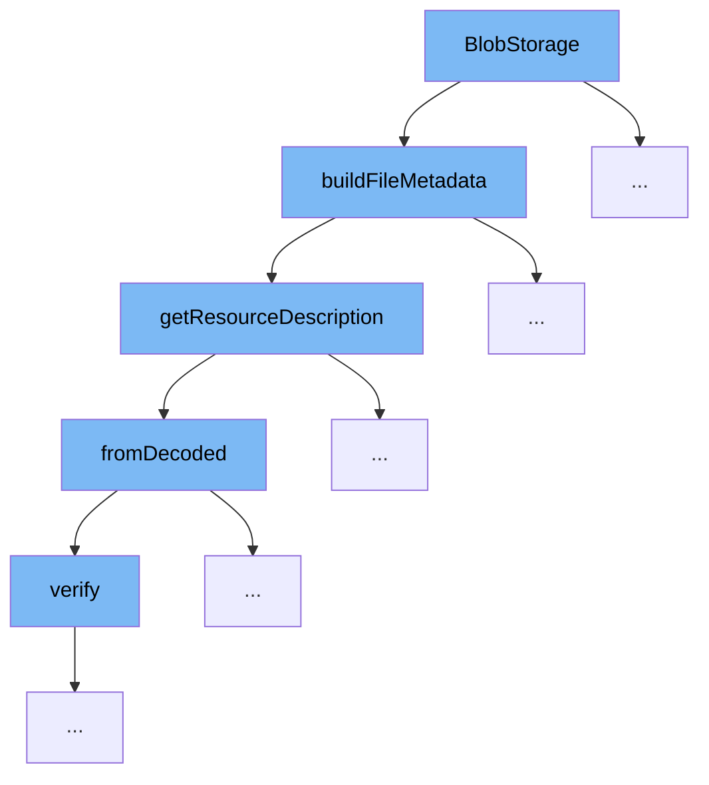

This document outlines the flow of metadata construction and resource description handling in the BlobStorage class. We'll cover:

1. How BlobStorage initiates metadata construction
2. The process of building file metadata
3. Retrieving and decoding resource descriptions
4. Verification of resource paths



<SwmSnippet path="/src/main/java/com/epam/aidial/core/storage/BlobStorage.java" line="273">

---

# BlobStorage Metadata Construction

The `BlobStorage` class initiates the metadata construction process by calling `buildFileMetadata`, which constructs metadata based on the resource description and storage metadata provided.

```java
    private MetadataBase buildFileMetadata(ResourceDescription resource, StorageMetadata metadata) {
        String bucketName = resource.getBucketName();
        ResourceDescription resultResource = getResourceDescription(resource.getType(), bucketName,
                resource.getBucketLocation(), metadata.getName());

        return switch (metadata.getType()) {
            case BLOB -> {
                String blobContentType = ((BlobMetadata) metadata).getContentMetadata().getContentType();
                if (blobContentType != null && blobContentType.equals(DEFAULT_CONTENT_TYPE)) {
                    blobContentType = BlobStorageUtil.getContentType(metadata.getName());
                }

                yield new FileMetadata(resultResource, metadata.getSize(), blobContentType);
            }
            case FOLDER, RELATIVE_PATH -> new ResourceFolderMetadata(resultResource);
            case CONTAINER -> throw new IllegalArgumentException("Can't list container");
        };
    }
```

---

</SwmSnippet>

<SwmSnippet path="/src/main/java/com/epam/aidial/core/storage/BlobStorage.java" line="273">

---

# Building File Metadata

In `buildFileMetadata`, the method `getResourceDescription` is called to retrieve the description of the resource, which is essential for constructing the correct metadata for the file.

```java
    private MetadataBase buildFileMetadata(ResourceDescription resource, StorageMetadata metadata) {
        String bucketName = resource.getBucketName();
        ResourceDescription resultResource = getResourceDescription(resource.getType(), bucketName,
                resource.getBucketLocation(), metadata.getName());

        return switch (metadata.getType()) {
            case BLOB -> {
                String blobContentType = ((BlobMetadata) metadata).getContentMetadata().getContentType();
                if (blobContentType != null && blobContentType.equals(DEFAULT_CONTENT_TYPE)) {
                    blobContentType = BlobStorageUtil.getContentType(metadata.getName());
                }

                yield new FileMetadata(resultResource, metadata.getSize(), blobContentType);
            }
            case FOLDER, RELATIVE_PATH -> new ResourceFolderMetadata(resultResource);
            case CONTAINER -> throw new IllegalArgumentException("Can't list container");
        };
    }
```

---

</SwmSnippet>

<SwmSnippet path="/src/main/java/com/epam/aidial/core/storage/BlobStorage.java" line="292">

---

# Retrieving and Decoding Resource Descriptions

The `getResourceDescription` method retrieves and decodes the resource description based on the resource type, bucket name, and location. This decoded information is crucial for the accurate representation of the resource in the system.

```java
    private ResourceDescription getResourceDescription(ResourceType resourceType, String bucketName, String bucketLocation, String absoluteFilePath) {
        // bucketLocation + resourceType + /
        int bucketAndResourceCharsLength = bucketLocation.length() + resourceType.getGroup().length() + 1;
        // bucketAndResourceCharsLength or bucketAndResourceCharsLength + prefix + /
        int charsToSkip = prefix == null ? bucketAndResourceCharsLength : prefix.length() + 1 + bucketAndResourceCharsLength;
        String relativeFilePath = absoluteFilePath.substring(charsToSkip);
        return ResourceDescription.fromDecoded(resourceType, bucketName, bucketLocation, relativeFilePath);
    }
```

---

</SwmSnippet>

<SwmSnippet path="/src/main/java/com/epam/aidial/core/storage/ResourceDescription.java" line="273">

---

# Verification of Resource Paths

The `verify` method in `ResourceDescription` ensures that the resource path provided matches the expected format. This verification step is critical to prevent errors in resource handling and metadata construction.

```java
    private static void verify(boolean condition, String message) {
        if (!condition) {
            throw new IllegalArgumentException(message);
        }
    }
```

---

</SwmSnippet>

&nbsp;

*This is an auto-generated document by Swimm AI 🌊 and has not yet been verified by a human*

<SwmMeta version="3.0.0" repo-id="Z2l0aHViJTNBJTNBYWktZGlhbC1jb3JlJTNBJTNBc3dpbW1pbw==" repo-name="ai-dial-core"><sup>Powered by [Swimm](/)</sup></SwmMeta>
