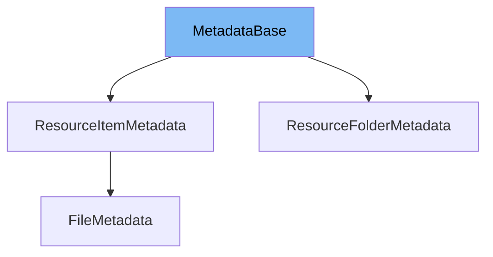

This document provides a comprehensive overview of the `MetadataBase` class used in the ai-dial-core project. We will cover:

1. What `MetadataBase` is and its purpose.
2. The variables and functions defined within `MetadataBase`.
3. An example usage of `MetadataBase` in the `ResourceFolderMetadata` class.



# What is MetadataBase

`MetadataBase` is an abstract class that serves as a foundational component for metadata management within the ai-dial-core project. It is designed to hold common metadata attributes such as name, parent path, bucket, URL, node type, and resource type, which are essential for identifying and organizing resources in the system.

<SwmSnippet path="/src/main/java/com/epam/aidial/core/data/MetadataBase.java" line="11">

---

# Variables and functions

The `MetadataBase` class defines several private variables: `name`, `parentPath`, `bucket`, `url`, `nodeType`, and `resourceType`. These variables store the basic metadata for resources managed within the system.

```java
    private String name;
    private String parentPath;
    private String bucket;
    private String url;
    private NodeType nodeType;
    private ResourceType resourceType;
}
```

---

</SwmSnippet>

<SwmSnippet path="/src/main/java/com/epam/aidial/core/data/ResourceFolderMetadata.java" line="22">

---

# Usage example

Here is an example of how `MetadataBase` is extended in the `ResourceFolderMetadata` class. This class uses the metadata base to further define a folder structure in the system, including handling lists of metadata items and pagination through the `nextToken`.

```java
    public ResourceFolderMetadata(ResourceType type, String bucket, String name, String path, String url, List<MetadataBase> items) {
        super(name, path, bucket, url, NodeType.FOLDER, type);
        this.items = items;
    }

    public ResourceFolderMetadata(ResourceType type, String bucket, String name, String path, String url) {
        this(type, bucket, name, path, url, null);
    }

    public ResourceFolderMetadata(ResourceDescription resource) {
        this(resource, null);
    }

    public ResourceFolderMetadata(ResourceDescription resource, List<MetadataBase> items) {
        this(resource.getType(), resource.getBucketName(), resource.getName(), resource.getParentPath(), resource.getUrl(), items);
    }
```

---

</SwmSnippet>

&nbsp;

*This is an auto-generated document by Swimm AI 🌊 and has not yet been verified by a human*

<SwmMeta version="3.0.0" repo-id="Z2l0aHViJTNBJTNBYWktZGlhbC1jb3JlJTNBJTNBZXBhbQ==" repo-name="ai-dial-core"><sup>Powered by [Swimm](/)</sup></SwmMeta>
