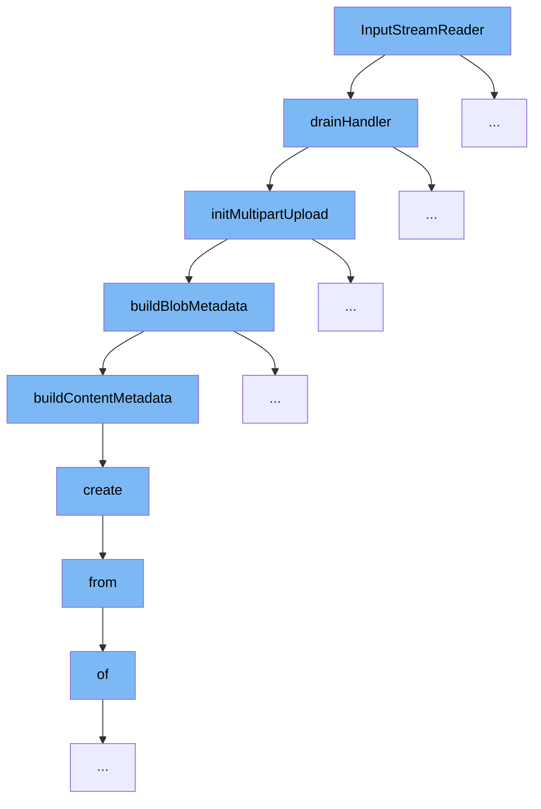

This document outlines the flow of handling large file uploads in the ai-dial-core system, specifically focusing on the multipart upload process. The steps involved are:

1. Handling incoming data streams.
2. Initializing multipart uploads.
3. Building metadata for blobs.
4. Creating content metadata.
5. Configuring credential providers.



<SwmSnippet path="/src/main/java/com/epam/aidial/core/storage/BlobWriteStream.java" line="144">

---

# Handling Incoming Data Streams

The `drainHandler` function in `BlobWriteStream` manages incoming data streams by buffering data until it's ready to be uploaded. It initializes the multipart upload process if it hasn't been started yet and stores each part of the multipart upload.

```java
    public WriteStream<Buffer> drainHandler(Handler<Void> handler) {
        vertx.executeBlocking(() -> {
            synchronized (BlobWriteStream.this) {
                try {
                    if (mpu == null) {
                        mpu = storage.initMultipartUpload(resource.getAbsoluteFilePath(), contentType);
                    }
                    MultipartPart part = storage.storeMultipartPart(mpu, ++chunkNumber, chunkBuffer.slice(0, position));
                    parts.add(part);
                    position = 0;
                    isBufferFull = false;
                } catch (Throwable ex) {
                    exception = ex;
                } finally {
                    if (handler != null) {
                        handler.handle(null);
                    }
                }
            }
            return null;
        });
```

---

</SwmSnippet>

<SwmSnippet path="/src/main/java/com/epam/aidial/core/storage/BlobStorage.java" line="85">

---

# Initializing Multipart Uploads

The `initMultipartUpload` function in `BlobStorage` initializes the multipart upload process by setting up the necessary metadata and starting the upload session with the storage backend.

```java
    public MultipartUpload initMultipartUpload(String absoluteFilePath, String contentType) {
        String storageLocation = getStorageLocation(absoluteFilePath);
        BlobMetadata metadata = buildBlobMetadata(storageLocation, contentType, bucketName);
        return blobStore.initiateMultipartUpload(bucketName, metadata, PutOptions.NONE);
    }
```

---

</SwmSnippet>

<SwmSnippet path="/src/main/java/com/epam/aidial/core/storage/BlobStorage.java" line="301">

---

# Building Metadata for Blobs

The `buildBlobMetadata` function constructs the metadata for the blob, which includes content type and other relevant information needed for the storage system.

```java
    private static BlobMetadata buildBlobMetadata(String absoluteFilePath, String contentType, String bucketName) {
        ContentMetadata contentMetadata = buildContentMetadata(contentType);
        return new BlobMetadataImpl(null, absoluteFilePath, null, null, null, null, null, Map.of(), null, bucketName, contentMetadata, null, Tier.STANDARD);
    }
```

---

</SwmSnippet>

<SwmSnippet path="/src/main/java/com/epam/aidial/core/storage/BlobStorage.java" line="306">

---

# Creating Content Metadata

The `buildContentMetadata` function creates metadata specifically for the content of the blob, detailing the type of content being uploaded.

```java
    private static ContentMetadata buildContentMetadata(String contentType) {
        ContentMetadata contentMetadata = ContentMetadataBuilder.create()
                .contentType(contentType)
                .build();
        return BaseMutableContentMetadata.fromContentMetadata(contentMetadata);
    }
```

---

</SwmSnippet>

<SwmSnippet path="/src/main/java/com/epam/aidial/core/storage/credential/CredentialProviderFactory.java" line="8">

---

# Configuring Credential Providers

The `create` function in `CredentialProviderFactory` configures the appropriate credential provider based on the storage provider, which is essential for authenticating the upload session.

```java
    public static CredentialProvider create(String providerName, String identity, String credential) {
        StorageProvider provider = StorageProvider.from(providerName);
        return switch (provider) {
            case S3 -> new DefaultCredentialProvider(identity, credential);
            case AZURE_BLOB -> new AzureCredentialProvider(identity, credential);
            case GOOGLE_CLOUD_STORAGE -> new GcpCredentialProvider(identity, credential);
            case FILESYSTEM -> new DefaultCredentialProvider("identity", "credential");
            case AWS_S3 -> new AwsCredentialProvider(identity, credential);
        };
    }
```

---

</SwmSnippet>

&nbsp;

*This is an auto-generated document by Swimm AI 🌊 and has not yet been verified by a human*

<SwmMeta version="3.0.0" repo-id="Z2l0aHViJTNBJTNBYWktZGlhbC1jb3JlJTNBJTNBc3dpbW1pbw==" repo-name="ai-dial-core"><sup>Powered by [Swimm](/)</sup></SwmMeta>
