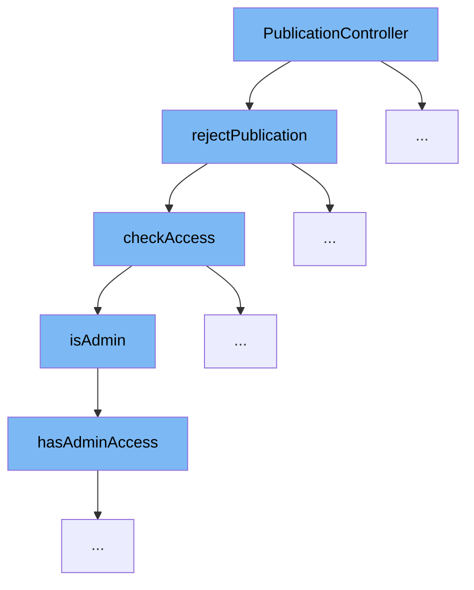

This document outlines the flow of rejecting a publication through the `PublicationController` in the ai-dial-core project. We'll cover the following steps:

1. Initiating the rejection of a publication.
2. Checking access permissions.
3. Determining administrative access.



<SwmSnippet path="/src/main/java/com/epam/aidial/core/controller/PublicationController.java" line="125">

---

# Initiating the Rejection of a Publication

The `rejectPublication` method in `PublicationController` starts the process of rejecting a publication. It decodes the publication URL, checks access, and if allowed, executes the rejection through the `publicationService`.

```java
    public Future<?> rejectPublication() {
        context.getRequest()
                .body()
                .compose(body -> {
                    String url = ProxyUtil.convertToObject(body, ResourceLink.class).url();
                    ResourceDescription resource = decodePublication(url, false);
                    checkAccess(resource, false);
                    return vertx.executeBlocking(() -> publicationService.rejectPublication(resource));
                })
                .onSuccess(publication -> context.respond(HttpStatus.OK, publication))
                .onFailure(error -> respondError("Can't reject publication", error));

        return Future.succeededFuture();
```

---

</SwmSnippet>

<SwmSnippet path="/src/main/java/com/epam/aidial/core/controller/PublicationController.java" line="228">

---

# Checking Access Permissions

The `checkAccess` method is called within `rejectPublication` to verify if the user has the necessary permissions to reject the publication. It checks if the user is an admin or if the user is allowed based on the publication's bucket location.

```java
    private void checkAccess(ResourceDescription resource, boolean allowUser) {
        boolean hasAccess = isAdmin();

        if (!hasAccess && allowUser) {
            String bucket = BlobStorageUtil.buildInitiatorBucket(context);
            hasAccess = resource.getBucketLocation().equals(bucket);
        }

        if (!hasAccess) {
            throw new HttpException(HttpStatus.FORBIDDEN, "Forbidden resource: " + resource.getUrl());
        }
    }
```

---

</SwmSnippet>

<SwmSnippet path="/src/main/java/com/epam/aidial/core/controller/PublicationController.java" line="241">

---

# Determining Administrative Access

The `isAdmin` method, called by `checkAccess`, determines if the current user has administrative privileges by checking with the `accessService`.

```java
    private boolean isAdmin() {
        return accessService.hasAdminAccess(context);
    }
```

---

</SwmSnippet>

&nbsp;

*This is an auto-generated document by Swimm AI 🌊 and has not yet been verified by a human*

<SwmMeta version="3.0.0" repo-id="Z2l0aHViJTNBJTNBYWktZGlhbC1jb3JlJTNBJTNBc3dpbW1pbw==" repo-name="ai-dial-core"><sup>Powered by [Swimm](/)</sup></SwmMeta>
