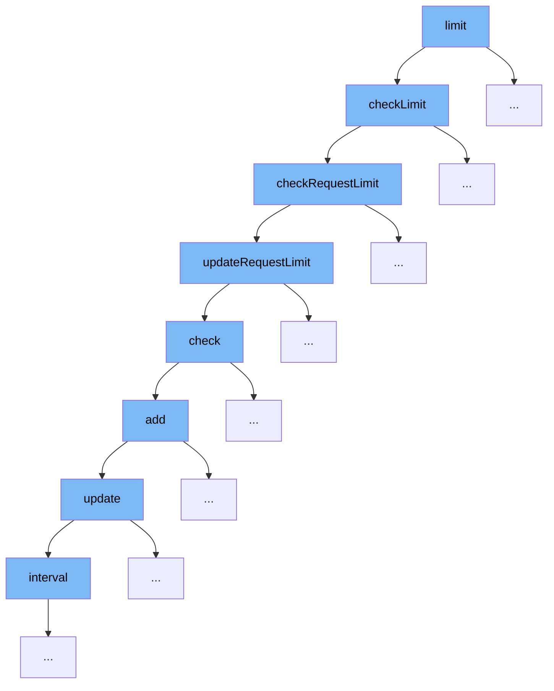

This document outlines the rate limiting mechanism in the ai-dial-core project, focusing on the function `limit` and its subsequent call flow. We'll explore:

1. The initiation of rate limiting via the `limit` function.
2. How limits are checked and requests are managed.
3. The updating and checking of request limits.
4. The validation and addition of token rates.



<SwmSnippet path="/src/main/java/com/epam/aidial/core/limiter/RateLimiter.java" line="170">

---

# Initiation of Rate Limiting

The `limit` function initiates the rate limiting process by calling `checkLimit`. This function checks if the current request exceeds the set limits for tokens and requests, ensuring that the system adheres to predefined constraints.

```java
    private RateLimitResult checkLimit(ProxyContext context, Limit limit) {
        long timestamp = System.currentTimeMillis();
        RateLimitResult tokenResult = checkTokenLimit(context, limit, timestamp);
        if (tokenResult.status() != HttpStatus.OK) {
            return tokenResult;
        }
        return checkRequestLimit(context, limit, timestamp);
    }
```

---

</SwmSnippet>

<SwmSnippet path="/src/main/java/com/epam/aidial/core/limiter/RateLimiter.java" line="190">

---

# Managing Request Limits

The `checkRequestLimit` function is called next, which manages the request limits by computing the resource usage and updating the request limit accordingly. This step is crucial for maintaining the integrity of rate limiting by ensuring that each request is accounted for.

```java
    private RateLimitResult checkRequestLimit(ProxyContext context, Limit limit, long timestamp) {
        String tokensPath = getPathToRequests(context.getDeployment().getName());
        ResourceDescription resourceDescription = getResourceDescription(context, tokensPath);
        // pass array to hold rate limit result returned by the function to compute the resource
        RateLimitResult[] result = new RateLimitResult[1];
        resourceService.computeResource(resourceDescription, json -> updateRequestLimit(json, timestamp, limit, result));
        return result[0];
    }
```

---

</SwmSnippet>

<SwmSnippet path="/src/main/java/com/epam/aidial/core/limiter/RateLimiter.java" line="199">

---

# Updating and Checking Request Limits

The `updateRequestLimit` function updates the request limit based on the current usage and checks if the new request can be accommodated within the set limits. This function is pivotal in dynamically adjusting the limits based on real-time data.

```java
    private String updateRequestLimit(String json, long timestamp, Limit limit, RateLimitResult[] result) {
        RequestRateLimit rateLimit = ProxyUtil.convertToObject(json, RequestRateLimit.class);
        if (rateLimit == null) {
            rateLimit = new RequestRateLimit();
        }
        result[0] = rateLimit.check(timestamp, limit, 1);
        return ProxyUtil.convertToString(rateLimit);
    }
```

---

</SwmSnippet>

<SwmSnippet path="/src/main/java/com/epam/aidial/core/limiter/RequestRateLimit.java" line="13">

---

# Validation and Addition of Token Rates

The `check` function within the `RequestRateLimit` class is responsible for validating if the current request exceeds the hourly or daily limits. If not, it proceeds to add the request count to the respective time buckets, ensuring accurate tracking of request rates.

```java
    public RateLimitResult check(long timestamp, Limit limit, long count) {
        long hourTotal = hour.update(timestamp);
        long dayTotal = day.update(timestamp);

        boolean result = hourTotal >= limit.getRequestHour() || dayTotal >= limit.getRequestDay();
        if (result) {
            String errorMsg = String.format("""
                            Hit request rate limit:
                             - hour limit: %d / %d requests
                             - day limit: %d / %d requests
                            """,
                    hourTotal, limit.getRequestHour(), dayTotal, limit.getRequestDay());
            return new RateLimitResult(HttpStatus.TOO_MANY_REQUESTS, errorMsg);
        } else {
            hour.add(timestamp, count);
            day.add(timestamp, count);
            return RateLimitResult.SUCCESS;
        }
    }
```

---

</SwmSnippet>

&nbsp;

*This is an auto-generated document by Swimm AI 🌊 and has not yet been verified by a human*

<SwmMeta version="3.0.0" repo-id="Z2l0aHViJTNBJTNBYWktZGlhbC1jb3JlJTNBJTNBZXBhbQ==" repo-name="ai-dial-core"><sup>Powered by [Swimm](/)</sup></SwmMeta>
