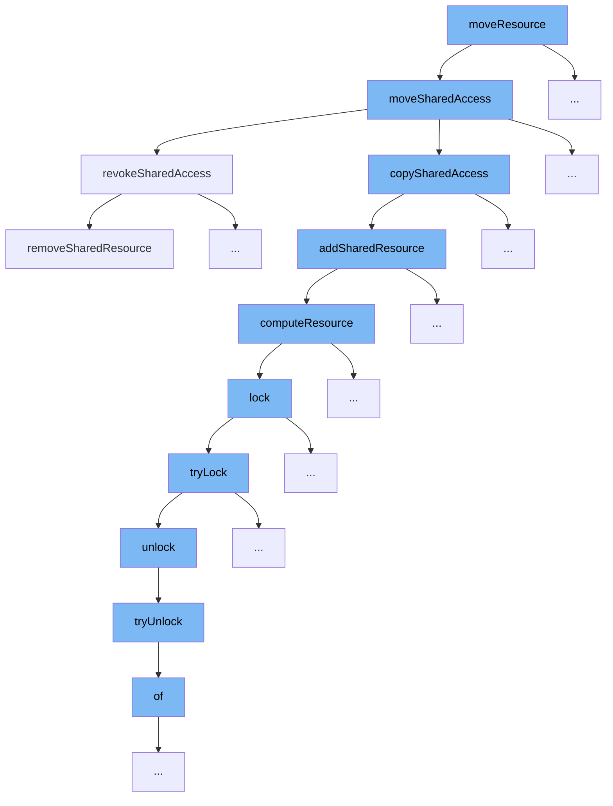

This document will explain the flow initiated by the `moveResource` function, detailing each step and its purpose in the context of resource management in the ai-dial-core project. The steps include:



<SwmSnippet path="/src/main/java/com/epam/aidial/core/service/ShareService.java" line="357">

---

# Overview of `moveResource` Function

The `moveResource` function orchestrates the process of transferring shared access of a resource from one location to another. It first copies the shared access and then revokes the original shared access, ensuring the resource is only accessible from the new location.

```java
    public void moveSharedAccess(String bucket, String location, ResourceDescription source, ResourceDescription destination) {
        // copy shared access from source to destination
        copySharedAccess(bucket, location, source, destination);
        // revoke shared access from source
        revokeSharedAccess(bucket, location, new ResourceLinkCollection(Set.of(new ResourceLink(source.getUrl()))));
    }
```

---

</SwmSnippet>

<SwmSnippet path="/src/main/java/com/epam/aidial/core/service/ShareService.java" line="359">

---

# Step 1: Copy Shared Access

The `copySharedAccess` function is called to replicate the shared access settings from the source to the destination. This ensures that all shared access permissions are maintained during the move.

```java
        copySharedAccess(bucket, location, source, destination);
```

---

</SwmSnippet>

<SwmSnippet path="/src/main/java/com/epam/aidial/core/service/ShareService.java" line="361">

---

# Step 2: Revoke Original Shared Access

After successfully copying the shared access, `revokeSharedAccess` is invoked to remove the shared access from the original location, securing the resource's integrity and access control.

```java
        revokeSharedAccess(bucket, location, new ResourceLinkCollection(Set.of(new ResourceLink(source.getUrl()))));
```

---

</SwmSnippet>

&nbsp;

*This is an auto-generated document by Swimm AI 🌊 and has not yet been verified by a human*

<SwmMeta version="3.0.0" repo-id="Z2l0aHViJTNBJTNBYWktZGlhbC1jb3JlJTNBJTNBZXBhbQ==" repo-name="ai-dial-core"><sup>Powered by [Swimm](/)</sup></SwmMeta>
