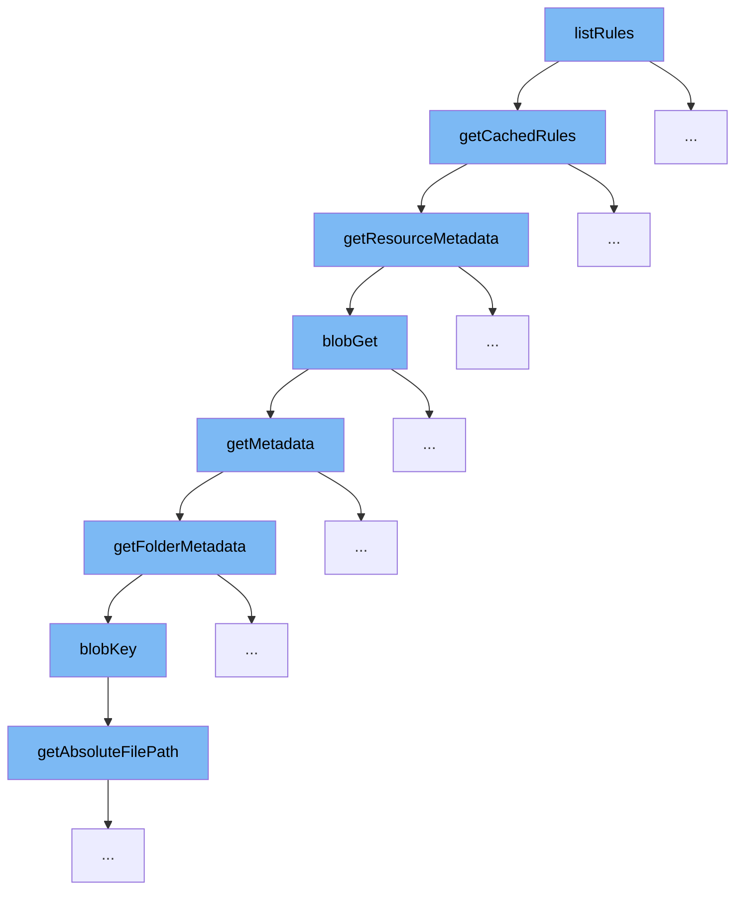

This document outlines the flow of rule retrieval and caching in the ai-dial-core project, focusing on the `listRules` function. We'll explore:

1. How rules are listed and retrieved from cache.
2. The retrieval of resource metadata.
3. Accessing blob storage for metadata.
4. Handling folder-specific metadata.



<SwmSnippet path="/src/main/java/com/epam/aidial/core/service/PublicationService.java" line="603">

---

# Listing and Retrieving Rules from Cache

The `listRules` function initiates the rule retrieval process by calling `getCachedRules`, which checks if the rules are already cached and up-to-date. If not, it fetches updated rules and metadata, ensuring that the most current rules are used.

```java
    private Map<String, List<Rule>> getCachedRules() {
        ResourceItemMetadata meta = resources.getResourceMetadata(PUBLIC_RULES);
        long key = (meta == null) ? Long.MIN_VALUE : meta.getUpdatedAt();
        Pair<Long, Map<String, List<Rule>>> current = cachedRules.get();

        if (current == null || current.getKey() != key) {
            Pair<ResourceItemMetadata, String> resource = resources.getResourceWithMetadata(PUBLIC_RULES);
            Pair<Long, Map<String, List<Rule>>> next = (resource == null)
                    ? Pair.of(Long.MIN_VALUE, decodeRules(null))
                    : Pair.of(resource.getKey().getUpdatedAt(), decodeRules(resource.getValue()));

            cachedRules.compareAndSet(current, next);
            current = next;
        }

        return current.getValue();
    }
```

---

</SwmSnippet>

<SwmSnippet path="/src/main/java/com/epam/aidial/core/service/ResourceService.java" line="160">

---

# Retrieving Resource Metadata

The `getCachedRules` function calls `getResourceMetadata` to obtain metadata for the resources. This function handles the logic to retrieve metadata from Redis or blob storage based on the resource description, which is crucial for determining the freshness of the cached rules.

```java
    public ResourceItemMetadata getResourceMetadata(ResourceDescription descriptor) {
        if (descriptor.isFolder()) {
            throw new IllegalArgumentException("Resource folder: " + descriptor.getUrl());
        }

        String redisKey = redisKey(descriptor);
        String blobKey = blobKey(descriptor);
        Result result = redisGet(redisKey, false);

        if (result == null) {
            result = blobGet(blobKey, false);
        }

        if (!result.exists) {
            return null;
        }

        return new ResourceItemMetadata(descriptor)
                .setCreatedAt(result.createdAt)
                .setUpdatedAt(result.updatedAt);
    }
```

---

</SwmSnippet>

<SwmSnippet path="/src/main/java/com/epam/aidial/core/service/ResourceService.java" line="369">

---

# Accessing Blob Storage for Metadata

If the metadata is not found in Redis, `blobGet` is called to fetch it directly from blob storage. This function retrieves the blob metadata or the blob itself if needed, which includes creation and update timestamps essential for cache validation.

```java
    @SneakyThrows
    private Result blobGet(String key, boolean withBody) {
        Blob blob = null;
        BlobMetadata meta;

        if (withBody) {
            blob = blobStore.load(key);
            meta = (blob == null) ? null : blob.getMetadata();
        } else {
            meta = blobStore.meta(key);
        }

        if (meta == null) {
            return BLOB_NOT_FOUND;
        }

        long createdAt = Long.parseLong(meta.getUserMetadata().get("created_at"));
        long updatedAt = Long.parseLong(meta.getUserMetadata().get("updated_at"));

        String body = "";

```

---

</SwmSnippet>

<SwmSnippet path="/src/main/java/com/epam/aidial/core/service/ResourceService.java" line="121">

---

# Handling Folder-Specific Metadata

For resources identified as folders, `getFolderMetadata` is utilized to handle metadata retrieval. It lists all metadata for the contents of the folder, which can include multiple resources, each potentially affecting the overall cache state of rules.

```java
    private ResourceFolderMetadata getFolderMetadata(ResourceDescription descriptor, String token, int limit, boolean recursive) {
        String blobKey = blobKey(descriptor);
        PageSet<? extends StorageMetadata> set = blobStore.list(blobKey, token, limit, recursive);

        if (set.isEmpty() && !descriptor.isRootFolder()) {
            return null;
        }

        List<MetadataBase> resources = set.stream().map(meta -> {
            Map<String, String> metadata = meta.getUserMetadata();
            String path = meta.getName();
            ResourceDescription description = ResourceDescription.fromDecoded(descriptor, path);

            if (meta.getType() != StorageType.BLOB) {
                return new ResourceFolderMetadata(description);
            }

            Long createdAt = null;
            Long updatedAt = null;

            if (metadata != null) {
```

---

</SwmSnippet>

&nbsp;

*This is an auto-generated document by Swimm AI 🌊 and has not yet been verified by a human*

<SwmMeta version="3.0.0" repo-id="Z2l0aHViJTNBJTNBYWktZGlhbC1jb3JlJTNBJTNBc3dpbW1pbw==" repo-name="ai-dial-core"><sup>Powered by [Swimm](/)</sup></SwmMeta>
